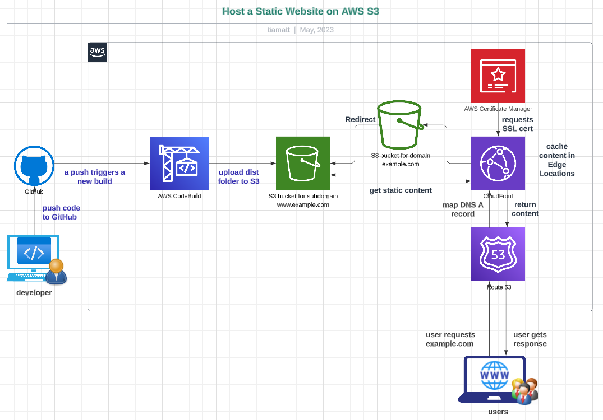

# Topic 2 - Https Static Website on AWS S3 with a public DNS (www/naked)domain

###### Yuanchao Hands-on Project

###### Check better this doc and project template on Github  [here](https://github.com/lyc-handson-aws/handson-topic1)

## **Overview** 

**Project's main points**

:point_right:  AWS S3 Bucket with static website configuration

:point_right:  AWS S3 bucket with block public access disabled: allow S3 bucket to be accessed by Public

:point_right: AWS S3 Bucket with a simple native redirect rule: a predefined route(by parm) is redirected to root path(index.html), other no-existed path is redirected to error.html

## **Architecture**

the diagram below illustrates the architecture(principle) of this project:

## **CloudFormation Stack Quick-create Link**

Click here to quickly create a same project with the same AWS resources:  [here](https://us-east-1.console.aws.amazon.com/cloudformation/home?region=us-east-1#/stacks/create/review?templateURL=https://s3-lyc-handson-cfstacks.s3.eu-west-3.amazonaws.com/topic1.yaml)

> the CF's region "US East us-east-1"

## **AWS Resources**

Project's AWS resourcs:

:point_right: S3 bucket

:point_right: S3 bucket policy

:point_right: Cloudfront distribution

:point_right: Certificat service

:point_right: Route 53
